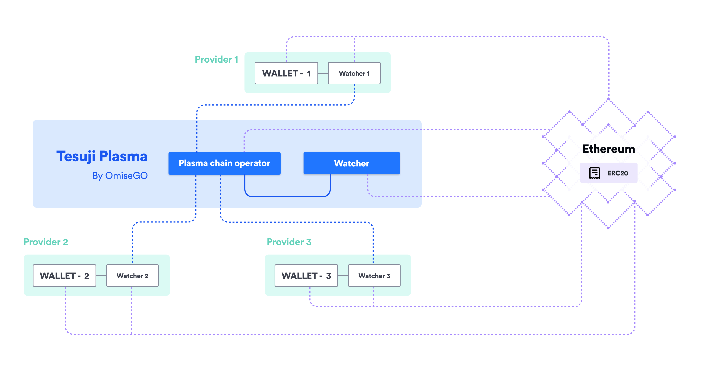

The `elixir-omg` repository contains OmiseGO's Elixir implementation of Plasma and forms the basis for the OMG Network.

[](https://circleci.com/gh/omisego/elixir-omg) [](https://coveralls.io/github/omisego/elixir-omg?branch=master) [](https://gitter.im/omisego/elixir-omg)

**IMPORTANT NOTICE: Heavily WIP, expect anything**

**Table of Contents**

<!--ts-->
   * [Getting Started](#getting-started)
      * [Service start up using Docker Compose](#service-start-up-using-docker-compose)
         * [Mac](#mac)
         * [Linux](#linux)
         * [Get the deployed contract details](#get-the-deployed-contract-details)
         * [Troubleshooting Docker](#troubleshooting-docker)
      * [Install on a Linux host &amp; manual start up](#install-on-a-linux-host--manual-start-up)
         * [Follow the demos](#follow-the-demos)
      * [Troubleshooting](#troubleshooting)
   * [elixir-omg applications](#elixir-omg-applications)
      * [Child chain server](#child-chain-server)
         * [Using the child chain server's API](#using-the-child-chain-servers-api)
            * [HTTP-RPC](#http-rpc)
         * [Running a child chain in practice](#running-a-child-chain-in-practice)
            * [Ethereum private key management](#ethereum-private-key-management)
               * [geth](#geth)
               * [parity](#parity)
            * [Specifying the fees required](#specifying-the-fees-required)
            * [Managing the operator address](#managing-the-operator-address)
               * [Nonces restriction](#nonces-restriction)
               * [Funding the operator address](#funding-the-operator-address)
      * [Watcher](#watcher)
         * [Modes of the watcher](#modes-of-the-watcher)
         * [Using the watcher](#using-the-watcher)
         * [Endpoints](#endpoints)
         * [Ethereum private key management](#ethereum-private-key-management-1)
      * [mix configuration parameters](#mix-configuration-parameters)
         * [Generic configuration - :omg app](#generic-configuration---omg-app)
         * [Child chain server configuration - :omg_child_chain app](#child-chain-server-configuration---omg_child_chain-app)
         * [Watcher configuration - :omg_watcher app](#watcher-configuration---omg_watcher-app)
         * [OMG.DB configuration - :omg_db app](#omgdb-configuration---omg_db-app)
         * [OMG.Eth configuration - :omg_eth app](#omgeth-configuration---omg_eth-app)
   * ["geth" | "parity" | "infura"](#geth--parity)
      * [Contracts](#contracts)
         * [Installing dependencies and compiling contracts](#installing-dependencies-and-compiling-contracts)
   * [Testing &amp; development](#testing--development)
   * [Working with API Spec's](#working-with-api-specs)

<!-- Added by: user, at: 2019-04-03T18:13+02:00 -->

<!--te-->

<!-- Created by [gh-md-toc](https://github.com/ekalinin/github-markdown-toc) -->
<!-- GH_TOC_TOKEN=75... ./gh-md-toc --insert ../omisego/README.md -->

The first release of the OMG Network is based upon **Tesuji Plasma**, an iterative design step over [Plasma MVP](https://github.com/omisego/plasma-mvp).
The diagram below illustrates the relationship between the wallet provider and how wallet providers connect to **Tesuji Plasma**.



See the [Tesuji Plasma design document](docs/tesuji_blockchain_design.md) for a full description for the Child Chain Server and Watcher.
**NOTE** not all parts of that design have been implemented!

# Getting Started

A public testnet for the OMG Network is coming soon.
However, if you are brave and want to test being a Tesuji Plasma chain operator, read on!

## Service start up using Docker Compose
This is the recommended method of starting the blockchain services, with the auxiliary services automatically provisioned through Docker.

Before attempting the start up please ensure that you are not running any services that are listening on the following TCP ports: 9656, 7434, 5000, 8545, 5432, 5433.
All commands should be run from the root of the repo.

**NOTE** known to work with `docker-compose version 1.24.0, build 0aa59064`, version `1.17` has had problems

To bring the entire system up:

```sh
docker-compose up
```

To bring only specific services up (eg: the childchain service, geth, etc...):

```sh
docker-compose up childchain geth ...
```

_(Note: This will also bring up any services childchain depends on.)_

To run a Watcher only, first make sure you sent an ENV variable called with `INFURA_API_KEY` with your api key and then run:

```sh
docker-compose -f docker-compose-watcher.yml up
```

### Get the deployed contract details

`curl localhost:5000/get_contract`

### Troubleshooting Docker
You can view the running containers via `docker ps`

If service start up is unsuccessful, containers can be left hanging which impacts the start of services on the future attempts of `docker-compose up`.
You can stop all running containers via `docker kill $(docker ps -q)`.

If the blockchain services are not already present on the host, docker-compose will attempt to build the image with the tag `elixir-omg:dockercompose` and continue to use that.
If you want Docker to use the latest commit from `elixir-omg` you can trigger a fresh build by passing the `--build` flag to `docker-compose up --build`.

## Install on a Linux host & manual start up
Follow the guide to **[install](docs/install.md)** the child chain server and watcher.
Then use the guide in **[manual service startup](docs/manual_service_startup.md)** to stand up.

### Follow the demos
After starting the child chain server and/or Watcher as above, you may follow the steps in the demo scripts.
Note that some steps should be performed in the Elixir shell (iex) and some in the shell directly.

To start a configured instance of the `iex` REPL, from the `elixir-omg` root directory inside the container do:
```bash
iex -S mix run --no-start --config ~/config.exs
```

Follow one of the scripts in the [docs](docs/) directory. Don't pick any `OBSOLETE` demos.

## Troubleshooting
Solutions to common problems may be found in the [troubleshooting](docs/troubleshooting.md) document.

# `elixir-omg` applications

`elixir-omg` is an umbrella app comprising of several Elixir applications:

The general idea of the apps responsibilities is:
  - `omg` - common application logic used by both the child chain server and watcher
  - `omg_bus` - an internal event bus to tie services together
  - `omg_child_chain` - child chain server
    - tracks Ethereum for things happening in the root chain contract (deposits/exits)
    - gathers transactions, decides on validity, forms blocks, persists
    - submits blocks to the root chain contract
    - see `apps/omg_child_chain/lib/omg_child_chain/application.ex` for a rundown of children processes involved
  - `omg_child_chain_rpc` - an HTTP-RPC server being the gateway to `omg_child_chain`
  - `omg_db` - wrapper around the child chain server's database to store the UTXO set and blocks necessary for state persistence
  - `omg_eth` - wrapper around the [Ethereum RPC client](https://github.com/exthereum/ethereumex)
  - `omg_performance` - performance tester for the child chain server
  - `omg_status` - application monitoring facilities
  - `omg_utils` - various non-omg-specific shared code
  - `omg_watcher` - the [Watcher](#watcher)
  - `omg_watcher_rpc` - an HTTP-RPC server being the gateway to `omg_watcher`
  - `xomg_tasks` - `Mix.Task` implementations for our `mix <...>` commands

See [application architecture](docs/architecture.md) for more details.

## Child chain server

`:omg_child_chain` is the Elixir app which runs the child chain server, whose API is exposed by `:omg_child_chain_rpc`.

For the responsibilities and design of the child chain server see [Tesuji Plasma Blockchain Design document](docs/tesuji_blockchain_design.md).

### Using the child chain server's API

The child chain server is listening on port `9656` by default.

#### HTTP-RPC

HTTP-RPC requests are served up on the port specified in `omg_child_chain_rpc`'s `config` (`:omg_child_chain_rpc, OMG.RPC.Web.Endpoint, http: [port: ...]`).
The available RPC calls are defined by `omg_child_chain` in `api.ex` - paths follow RPC convention e.g. `block.get`, `transaction.submit`.
All requests shall be POST with parameters provided in the request body in JSON object.
Object's properties names correspond to the names of parameters. Binary values shall be hex-encoded strings.

For API documentation see: https://omisego.github.io/elixir-omg.

### Running a child chain in practice

**TODO** other sections

#### Ethereum private key management

##### `geth`

Currently, the child chain server assumes that the authority account is unlocked or otherwise available on the Ethereum node.
This might change in the future.

##### `parity`

Since `parity` doesn't support indefinite unlocking of the account, handling of such key is yet to be solved.
Currently (an unsafely) such private key is read from a secret system environment variable and handed to `parity` for signing.

#### Specifying the fees required

The child chain server will require the incoming transactions to satisfy the fee requirement.
The fee requirement reads that at least one token being inputted in a transaction must cover the fee as specified.
In particular, note that the required fee must be paid in one token in its entirety.

The fees are configured in the config entries for `omg_child_chain` see [config secion](#mix-configuration-parameters).

#### Managing the operator address

(a.k.a `authority address`)

The Ethereum address which the operator uses to submit blocks to the root chain is a special address which must be managed accordingly to ensure liveness and security.

##### Nonces restriction

The [reorg protection mechanism](docs/tesuji_blockchain_design.md#reorgs) enforces there to be a strict relation between the `submitBlock` transactions and block numbers.
Child block number `1000` uses Ethereum nonce `1`, child block number `2000` uses Ethereum nonce `2`, **always**.
This provides a simple mechanism to avoid submitted blocks getting reordered in the root chain.

This restriction is respected by the child chain server (`OMG.ChildChain.BlockQueue`), whereby the Ethereum nonce is simply derived from the child block number.

As a consequence, the operator address must never send any other transactions, if it intends to continue submitting blocks.
(Workarounds to this limitation are available, if there's such requirement.)

**NOTE** Ethereum nonce `0` is necessary to call the `RootChain.init` function, which must be called by the operator address.
This means that the operator address must be a fresh address for every child chain brought to life.

##### Funding the operator address

The address that is running the child chain server and submitting blocks needs to be funded with Ether.
At the current stage this is designed as a manual process, i.e. we assume that every **gas reserve checkpoint interval**, someone will ensure that **gas reserve** worth of Ether is available for transactions.

Gas reserve must be enough to cover the gas reserve checkpoint interval of submitting blocks, assuming the most pessimistic scenario of gas price.

Calculate the gas reserve as follows:

```
gas_reserve = child_blocks_per_day * days_in_interval * gas_per_submission * highest_gas_price
```
where
```
child_blocks_per_day = ethereum_blocks_per_day / submit_period
```

**Submit period** is the number of Ethereum blocks per a single child block submission) - configured in `:omg_child_chain, :child_block_submit_period`

**Highest gas price** is the maximum gas price which the operator allows for when trying to have the block submission mined (operator always tries to pay less than that maximum, but has to adapt to Ethereum traffic) - configured in (**TODO** when doing OMG-47 task)

**Example**

Assuming:
- submission of a child block every Ethereum block
- 15 second block interval on Ethereum, on average
- weekly cadence of funding, i.e. `days_in_interval == 7`
- allowing gas price up to 40 Gwei
- `gas_per_submission == 71505` (checked for `RootChain.sol` [at this revision](https://github.com/omisego/plasma-contracts/commit/50653d52169a01a7d7d0b9e2e4e3c4a4b904f128).
C.f. [here](https://rinkeby.etherscan.io/tx/0x1a79fdfa310f91625d93e25139e15299b4ab272ae504c56b5798a018f6f4dc7b))

we get
```
gas_reserve ~= (4 * 60 * 24 / 1) * 7 * 71505 * (40 / 10**9)  ~= 115 ETH
```

**NOTE** that the above calculation doesn't imply this is what is going to be used within a week, just a pessimistic scenario to calculate an adequate reserve.
If one assumes an _average_ gas price of 4 Gwei, the amount is immediately reduced to ~11.5 ETH weekly.

## Watcher

The Watcher is an observing node that connects to Ethereum and the child chain server's API.
It ensures that the child chain is valid and notifies otherwise.
It exposes the information it gathers via an HTTP-RPC interface (driven by Phoenix).
It provides a secure proxy to the child chain server's API and to Ethereum, ensuring that sensitive requests are only sent to a valid chain.

For more on the responsibilities and design of the Watcher see [Tesuji Plasma Blockchain Design document](docs/tesuji_blockchain_design.md).

### Modes of the watcher

The watcher can be run in one of two modes:
  - **security-critical only**
    - intended to provide light-weight Watcher just to ensure security of funds deposited into the child chain
    - this mode will store all of the data required for security-critical operations (exiting, challenging, etc.)
    - it will not store data required for current and performant interacting with the child chain (spending, receiving tokens, etc.)
    - it will not expose some endpoints related to current and performant interacting with the child chain (`account.get_utxos`, `transaction.*`, etc.)
    - it will only require the `OMG.DB` key-value store database
    - this mode will prune all security-related data not necessary anymore for security reasons (from `OMG.DB`)
    - some requests to the API might be slow but must always work (called rarely in unhappy paths only, like mass exits)
  - **security-critical and informational API**
    - intended to provide convenient and performant API to the child chain data, on top of the security-related one
    - this mode will provide/store everything the **security-critical** mode does
    - this mode will store easily accessible register of all transactions _for a subset of addresses_ (currently, all addresses)
    - this mode will leverage the Postgres-based `WatcherDB` database

**TODO** the distinction between two modes isn't fully implemented yet.
Use the **security-critical and informational API** always for now.

### Using the watcher

The watcher is listening on port `7434` by default.

### Endpoints

For API documentation see: https://omisego.github.io/elixir-omg

### Ethereum private key management

Watcher doesn't hold or manage user's keys.
All signatures are assumed to be done outside.
A planned exception may be to allow Watcher to sign challenges, but using a non-sensitive/low-funded Ethereum account.

## `mix` configuration parameters

`Mix.Config` is currently used to configure all the parameters required to set the child chain server and watcher up.
Per usual practice, the default values are defined in `apps/<app>/config/config.exs`.

**NOTE**: all margins are denominated in Ethereum blocks

### Generic configuration - `:omg` app

* **`deposit_finality_margin`** - the margin that is waited after a `DepositCreated` event in the root chain contract.
Only after this margin had passed:
  - the child chain will allow spending the deposit
  - the watcher will consider a transaction spending this deposit a valid transaction

  It is important that for a given child chain, the child chain server and watchers use the same value of this margin.

  **NOTE**: This entry is defined in `omg`, despite not being accessed there, only in `omg_child_chain` and `omg_watcher`.
  The reason here is to minimize risk of Child Chain server's and Watcher's configuration entries diverging.

* **`ethereum_events_check_interval_ms`** - polling interval for pulling Ethereum events (logs) from the Ethereum client.

* **`coordinator_eth_height_check_interval_ms`** - polling interval for checking whether the root chain had progressed for the `RootChainCoordinator`.
Affects how quick the services reading Ethereum events realize there's a new block.

### Child chain server configuration - `:omg_child_chain` app

* **`submission_finality_margin`** - the margin waited before mined block submissions are purged from `BlockQueue`'s memory

* **`block_queue_eth_height_check_interval_ms`** - polling interval for checking whether the root chain had progressed for the `BlockQueue` exclusively

* **`fee_file_check_interval_ms`** - interval for checking updates in the `fee_specs.json` file to update the fees required.

* **`child_block_minimal_enqueue_gap`** - how many new Ethereum blocks must be mined, since previous submission **attempt**, before another block is going to be formed and submitted.

* **`fee_specs_file_name`** - path to file which defines fee requirements, see [fee_specs.json](fee_specs.json) for an example.

* **`ignore_fees`** - boolean option allowing to turn off fee charging altogether

### Watcher configuration - `:omg_watcher` app

* **`exit_processor_sla_margin`** - the margin to define the notion of a "late", invalid exit.
After this margin passes, every invalid exit is deemed a critical failure of the child chain (`unchallenged_exit`).
Such event will prompt a mass exit and stop processing new blocks.
See [exit validation documentation](docs/exit_validation.md) for details.
Override using the `EXIT_PROCESSOR_SLA_MARGIN` system environment variable.

* **`maximum_block_withholding_time_ms`** - for how long the Watcher will tolerate failures to get a submitted child chain block, before reporting a block withholding attack and stopping

* **`block_getter_loops_interval_ms`** - polling interval for checking new child chain blocks submissions being mined on the root chain

* **`maximum_number_of_unapplied_blocks`** - the maximum number of downloaded and statelessly validated child chain blocks to hold in queue for applying

* **`exit_finality_margin`** - the margin waited before an exit-related event is considered final enough to pull and process

* **`block_getter_reorg_margin`** - the margin considered by `OMG.Watcher.BlockGetter` when searching for recent child chain block submission events.
This is driving the process of determining the height and particular event related to the submission of a particular child chain block

### `OMG.DB` configuration - `:omg_db` app

* **`path`** - path to the directory holding the LevelDB data store

* **`server_module`** - the module to use when talking to the `OMG.DB`

* **`server_name`** - the named process to refer to when talking to the `OMG.DB`

### `OMG.Eth` configuration - `:omg_eth` app

All binary entries are expected in hex-encoded, `0x`-prefixed.

* **`contract_addr`** - the address of the root chain contract

* **`authority_addr`** - the address used by the operator to submit blocks

* **`txhash_contract`** - the Ethereum-transaction hash holding the deployment of the root chain contract

* **`eth_node`** - the Ethereum client which is used: `"geth" | "parity" | "infura" | "ganache"`.
Use `"ganache"` for tests only, also note that you must run `ganache-cli` yourself (e.g. using the provided `docker-compose-fixtures.yml` file).
When setting to `"ganache"`, set also `run_test_eth_dev_node` to `false`, to prevent tests from setting up the dev Ethereum node themselves.

* **`node_logging_in_debug`** - whether the output of the Ethereum node being run in integration test should be printed to `:debug` level logs.
If you set this to false, remember to set the logging level to `:debug` to see the logs

* **`child_block_interval`** - mirror of contract configuration `uint256 constant public CHILD_BLOCK_INTERVAL` from `RootChain.sol`

* **`min_exit_period_seconds`** - mirror of contract configuration `uint256 public minExitPeriod`

* **`ethereum_client_warning_time_ms`** - queries for event logs made to the Ethereum node lasting more than this will emit a `:warn`-level log

## Contracts

OMG network uses contract code from [the contracts repo](http://github.com/omisego/plasma-contracts).
Code from a particular branch in that repo is used, see [one of `mix.exs` configuration files](apps/omg_eth/mix.exs) for details.

Contract code is downloaded automatically when getting dependencies of the Mix application with `mix deps.get`.
You can find the downloaded version of that code under `deps/plasma_contracts`.

### Installing dependencies and compiling contracts

To install dependencies:
```bash
sudo apt-get install libssl-dev solc
```

Contracts will compile automatically as a regular mix dependency.
To compile contracts manually:
```bash
mix deps.compile plasma_contracts
```

# Testing & development

You can setup the docker environment to run testing and development tasks:

(Note: If they exist, be sure to delete the `deps` and `_build` dirs from your host drive. Otherwise these dirs will get mapped into the docker container and can create build discrepancies and breakages.)

```sh
docker-compose -f docker-compose.yml -f docker-compose.dev.yml run --rm --entrypoint bash elixir-omg
```

Once the shell has loaded, you can continue and run additional tasks.

Get the necessary dependencies for building:
```bash
mix deps.get
```

Quick test (no integration tests):
```bash
mix test
```

Longer-running integration tests (requires compiling contracts):
```bash
mix test --only integration
```

To run these tests with `parity` as a backend, set it via `ETH_NODE` environmental variable (default is `geth`):
```
ETH_NODE=parity mix test --only integration
```

For other kinds of checks, refer to the CI/CD pipeline (https://circleci.com/gh/omisego/workflows/elixir-omg).

To run a development `iex` REPL with all code loaded:
```bash
iex -S mix run --no-start
```

# Working with API Spec's

This repo contains `gh-pages` branch intended to host [Swagger-based](https://omisego.github.io/elixir-omg) API specification.
Branch `gh-pages` is totally diseparated from other development branches and contains just Slate generated page's files.

See [gh-pages README](https://github.com/omisego/elixir-omg/blob/gh-pages/docs/api_specs/README.md) for more details.
