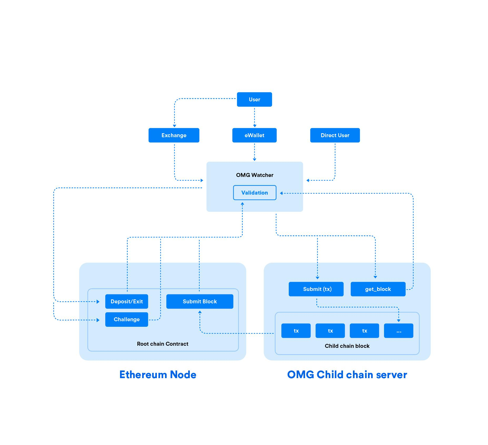

# Architecture

This is a high-level rundown of the architecture of the `elixir-omg` apps.

The below diagram demonstrates the various pieces and where this umbrella app fits in.

**NOTE** only use the high-level diagram to get a vague idea, meaning of boxes/arrows may be imprecise.

## Interactions

**[Diagram](https://docs.google.com/drawings/d/11ugr_VQzqh0afU6NPpHW893jww182POaGE3sYhgm9Gw/edit?usp=sharing)** illustrates the interactions described below.

This lists only interactions between the different processes that build up both the Child Chain Server and Watcher.
For responsibilities of the processes/modules look into respective docs in `.ex` files.

**NOTE** The hexagonal shape hints towards component being a wrapper (port/adapter) to something external, versus rectangular shape being an internal component.

### `OMG.State`

- writes blocks and UTXO set to `OMG.DB`
- pushes freshly formed blocks to `OMG.ChildChain.FreshBlocks`

### `OMG.ChildChain`

- accepts child chain transactions, decodes, stateless-validates and executes on `OMG.State`
- forwards `get_block` requests to `OMG.ChildChain.FreshBlocks`

### `OMG.ChildChain.FreshBlocks`

- reverts to reading `OMG.DB` for old blocks

### `OMG.RootChainCoordinator`

- reads Ethereum block height from `OMG.Eth`
- synchronizes view of Ethereum block height of all enrolled processes (see other processes descriptions)

### `:exiter`'s

Actually `OMG.EthereumEventListener` setup with `:exiter`.
**NOTE** there's a multitude of exiter-related processes, which work along these lines, we're not listing them here

- pushes exit-related events to `OMG.State` on child chain server's side
- pushes exit-related events to `OMG.Watcher.ExitProcessor` on watcher's side
- pushes exit-related events to `WatcherDB`

### `:depositor`

Actually `OMG.EthereumEventListener` setup with `:depositor`.

- pushes deposits to `OMG.State`
- pushes deposits to `WatcherDB`

### `OMG.ChildChain.BlockQueue`

- requests `form_block` on `OMG.State` and takes block hashes in return
- tracks Ethereum height and child chain block submission mining via `OMG.Eth` and `OMG.RootChainCoordinator`

### `OMG.ChildChain.FeeServer`
- `OMG.ChildChain` calls it to get required fee amounts to validate transactions

### `OMG.Watcher.BlockGetter`

- tracks child chain blocks via `OMG.RootChainCoordinator`
- manages concurrent `Task`'s to pull blocks from child chain server API (JSON-RPC)
- pushes decoded and statelessly valid blocks to `OMG.State`
- pushes statefully valid blocks and transactions (acknowledged by `OMG.State` above) to `WatcherDB`
- stops if `OMG.Watcher.ExitProcessor` reports a dangerous byzantine condition related to exits

### `OMG.Watcher.ExitProcessor`

- get various Ethereum events from `OMG.EthereumEventListener`
- used only in Watcher
- validates exits
- spends finalizing exits in `OMG.State`

### `OMG.WatcherRPC`

- uses `OMG.Watcher` to server user's requests

### `OMG.Performance`

- executes requests to `OMG.WatcherRPC`
- forces block forming by talking directly to `OMG.State`

## Databases

- The Child Chain talks to its local RocksDB
- The Watcher talks to its local RocksDB
- The Watcher Info talks to its local RocksDB and PostgreSQL

### `OMG.DB`

An "intimate" database for `OMG.State` that holds the UTXO set and blocks.
May be seen and read by other processes to sync on the persisted state of `OMG.State` and UTXO set by consequence.

Non-relational data, so we're having a simple KV for this.

Each instance of either Child Chain Server or Watcher should have it's own instance.

Database necessary to properly ensure validity and availability of blocks and transactions

- it is read by `OMG.State` on restart to discover where it left off, whole UTXO set is not loaded.
- it is read by many other processes to discover where they left off, on restart
- it is used for the Watcher's security critical features to access exits info and blocks

### Watcher Info DB

A database running used by the Watcher in convenience API mode **only**.

Holds all information necessary to conveniently manage the funds held:
- UTXOs owned by user's particular address(es)
- transaction history

Relational data, to be able to navigate through the transactions and UTXOs.
Implemented with PostgreSQL.
